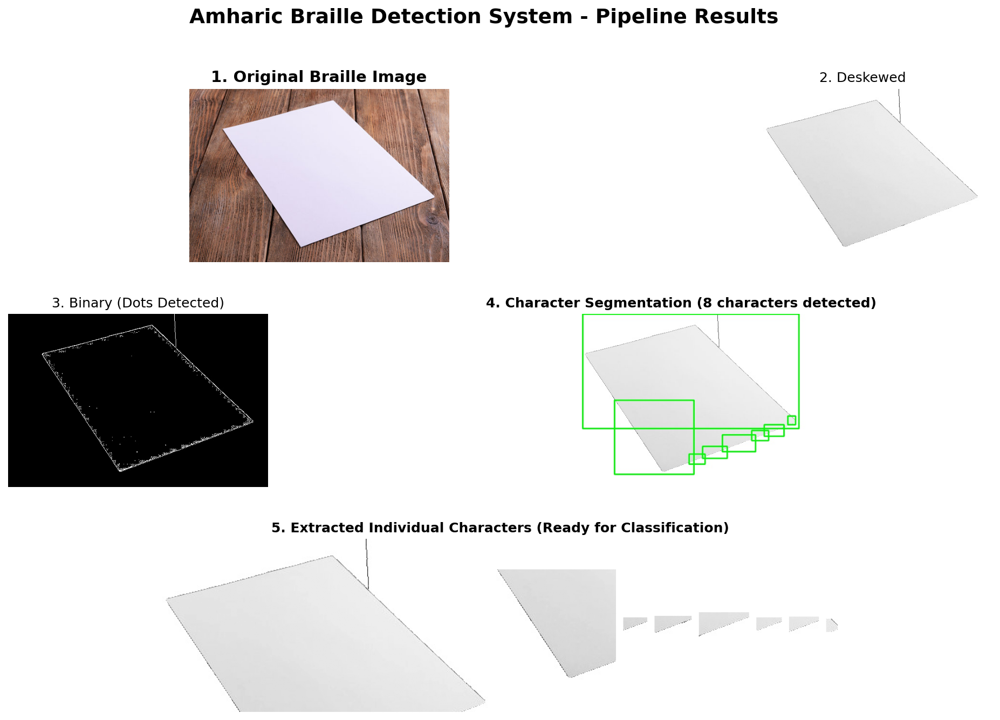

# Amharic Braille Detection using OpenCV

A computer vision-based solution for automatically detecting and interpreting Amharic Braille characters using OpenCV and deep learning.

## Overview

Amharic Braille is essential for visually impaired individuals who read and write in Amharic. This project provides an automated system to:
- Preprocess images of Amharic Braille documents
- Segment individual Braille characters
- Classify and interpret Braille characters using machine learning

## Features

- **Image Preprocessing**: Noise reduction, perspective correction, and adaptive thresholding
- **Character Segmentation**: Automatic detection and extraction of individual Braille characters
- **Classification**: Deep learning model for recognizing Amharic Braille characters
- **End-to-End Pipeline**: Complete workflow from image input to text output

## Installation

```bash
# Clone the repository
git clone https://github.com/Tseehay/amharic-braille-opencv.git
cd amharic-braille-opencv

# Install dependencies
pip install -r requirements.txt
```

## Usage

### Basic Usage

```python
from src.main import BrailleDetector

# Initialize detector
detector = BrailleDetector()

# Process an image
result = detector.process_image('path/to/braille_image.jpg')
print(result)
```

### Command Line Interface

```bash
# Process a single image
python main.py --image path/to/image.jpg

# Process multiple images
python main.py --batch --input-dir raw_dataset/ --output-dir results/
```

## Project Structure

```
amharic-braille-opencv/
├── src/
│   ├── braille_preprocessing.py   # Image preprocessing functions
│   ├── braille_segmentation.py    # Character segmentation
│   ├── braille_classifier.py      # ML classification model
│   ├── utils.py                   # Utility functions
│   └── main.py                    # Main pipeline
├── models/                        # Trained model files
├── raw_dataset/                   # Input images
├── output/                        # Processed results
├── braille_*.ipynb               # Jupyter notebooks for development
├── requirements.txt              # Python dependencies
└── README.md                     # This file
```

## How It Works

1. **Preprocessing**: The system applies noise reduction, edge detection, and perspective correction to prepare the image
2. **Segmentation**: Braille dots are detected and grouped into individual characters
3. **Classification**: A convolutional neural network classifies each character
4. **Output**: The system returns the detected text in Amharic



The image above shows the complete detection pipeline:
- Original input image with Braille characters
- Deskewed and corrected document
- Binary image showing detected Braille dots
- Character segmentation with bounding boxes
- Individual extracted characters ready for classification

## Development

The project includes Jupyter notebooks for interactive development:
- `braille_preprocessing.ipynb`: Preprocessing experiments
- `braille_segmentation.ipynb`: Segmentation development
- `braille_classification.ipynb`: Model training and evaluation
- `demo.ipynb`: Complete pipeline demonstration with examples

### Running the Demo Notebook

To try the system interactively:

```bash
jupyter notebook demo.ipynb
```

The demo notebook shows:
- Step-by-step pipeline execution
- Visualization of each processing stage
- Individual character extraction
- Batch processing examples

## Requirements

- Python 3.7+
- OpenCV 4.x
- NumPy
- TensorFlow 2.8+
- Matplotlib
- Pillow
- scikit-learn

## System Architecture

The system consists of four main components:

1. **BraillePreprocessor**: Handles image preprocessing
   - Noise reduction using Gaussian and bilateral filters
   - CLAHE for contrast enhancement
   - Paper region detection and isolation
   - Perspective correction using homography
   - Adaptive thresholding for binarization

2. **BrailleSegmenter**: Segments individual characters
   - Contour-based dot detection
   - Hierarchical grouping (dots → rows → letters)
   - Bounding box extraction
   - Configurable spacing thresholds

3. **BrailleClassifier**: CNN-based character classification
   - 3-layer CNN architecture
   - Batch normalization and dropout for regularization
   - Supports 38 Amharic characters
   - Training, evaluation, and inference methods

4. **BrailleDetector**: End-to-end pipeline integration
   - Combines all components
   - Single image and batch processing
   - Intermediate result visualization
   - Command-line interface

## Model Architecture

The CNN classifier uses the following architecture:

```
Input (64x64x1)
→ Conv2D(32) + BatchNorm + Conv2D(32) + BatchNorm + MaxPool + Dropout(0.25)
→ Conv2D(64) + BatchNorm + Conv2D(64) + BatchNorm + MaxPool + Dropout(0.25)
→ Conv2D(128) + BatchNorm + Conv2D(128) + BatchNorm + MaxPool + Dropout(0.25)
→ Dense(256) + BatchNorm + Dropout(0.5)
→ Dense(128) + BatchNorm + Dropout(0.5)
→ Dense(38, softmax)
```

**Note**: The model requires training with labeled Amharic Braille data. The current implementation provides the architecture and training pipeline.

## Contributing

Contributions are welcome! Please feel free to submit a Pull Request.

## License

This project is open source and available under the MIT License.

## Acknowledgments

This project aims to improve accessibility for Amharic-speaking visually impaired individuals by automating Braille text recognition.
